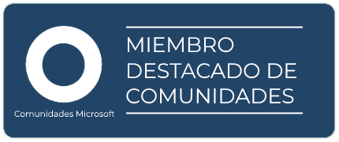

# Bienvenido [](https://ci.appveyor.com/project/wilsonvargas/NN)

Hola! Bienvenido al portal Comunidades Microsoft!

Si escribes sobre tecnologías Microsoft, tú perteneces aquí. Estaremos muy contentos de que seas parte de la comunidad y que puedas agregar tu blog como parte de nuestro feed siempre y cuando el contenido que está compartiendo no infrinja el [código de conducta](CODE_OF_CONDUCT.md)

# Agrega tu blog tú mismo

### Pautas para ser parte de este portal
- Tener un blog y un RSS con urls válidos, ambos usando HTTPS con un certificado válido.
- NO tengo contenido malicioso u ofensivo en mi blog (incluidas fotos, palabras ofensivas, etc.).
- Mi blog está activo con al menos 3 publicaciones relacionadas con tecnologías Microsoft en los últimos 6 meses.
- Si mi blog tiene contenido variado (artículos personales, artículos no relacionados) tendré agregar el tag "Microsoft" en mi contribución.
- Si borras tu blog serás eliminado del portal de Comunidades Microsoft.
- Tu blog puede ser eliminado en cualquier momento si alguna de estas pautas se rompe.

### Cómo agregarme

Para ser parte de este portal tú tienes que hacer un fork de este proyecto, agregarte a la [carpeta Authors](/src/Firehose.Web/Authors) como una clase, implementar la interfaz `IAmACommunityMember`. Si estás haciendo esto a través del editor de GitHub, no te olvides de _agregar la clase al archivo .csproj_.

El resultado debería verse algo así:

``` csharp
public class WilsonVargas : IAmACommunityMember
{
    public string FirstName => "Wilson";
    public string LastName => "Vargas";
    public string ShortBioOrTagLine => "al parecer es un zombie";
    public string StateOrRegion => "Trujillo, Peru";
    public string EmailAddress => "wilsonvargas@developermodeon.com";
    public string TwitterHandle => "wilsonvargas_m";
    public string GravatarHash => "3544142bb4e";
    public string GitHubHandle => "wilsonvargas";
    public GeoPosition Position => new GeoPosition(47.643417, -122.126083);
    public Uri WebSite => new Uri("https://blog.wilsonvargas.com");
    public IEnumerable<Uri> FeedUris { get { yield return new Uri("https://blog.wilsonvargas.com/rss/"); } }
}
```

Unos puntos más: 
- Escribir el nombre de la clase con tu nombre y apellido en **Pascal Case**.
- Las propiedades `FirstName` y `LastName` deben ser similares al nombre de la clase.
- La propiedad `ShortBioOrTagLine` puede contener lo que tú quieres y mejor te defina. Si no se te ocurre nada, puedes usar: 'Ingeniero de Software' o 'Ingeniero de Software en [Empresa]'. Por favor, se breve, como si fuese un tweet de 140 caracteres.
- `StateOrRegion` es tu ubicación geográfica, ejm.: Lima, Trujillo, etc.
- Las propiedades `EmailAddress`, `TwitterHandle` y `GitHubHandle` deben ser bastante claros, `TwitterHandle` sin el @
- `Position` es tu latitud y longitud, esto permite ubicarte en el mapa de la sección **Autores**
- La propiedad `Website` puede ser la dirección de tu blog o el enlace que quieras que las personas vean.
- En la propiedad `FeedUris` puedes poner uno o más URIs que se parezcan a tus blogs. Tus blogs deben proporcionarse en formato RSS (Atom) y, por supuesto, ser sobre tecnologías Microsoft.
- Y finalmente, si no deseas que tu dirección de correo esté disponible públicamente, pero deseas mostrar tu Gravatar, ve a https://en.gravatar.com/site/check/ y obten tu hash. Si no rellenas el hash, tu imagen será una silueta solamente.

Si haces alguna publicación sobre otras cosas, ¡no te preocupes! ¡Está bien! Échale un vistazo a la siguiente sección sobre cómo filtrar tus publicaciones de tecnologías Microsoft.

# Solo tecnologías Microsoft por favor

Por defecto, este portal no tiene un filtro predeterminado que busque publicaciones de tecnologías Microsoft en el título y las categorías (etiquetas) que tiene en sus publicaciones de blog. Este comportamiento se puede modificar implementando `IFilterMyBlogPosts`, donde puede implementar su propia lógica de filtrado.
Puede ser que desees deshabilitar todo el filtrado porque tu blog es únicamente sobre Xamarin. Tal vez, se ejecuta un boletín de noticias o podcast de Xamarin.

``` csharp
public class BruceWayne : IAmACommunityMember, IFilterMyBlogPosts
{
    // ... Author properties from the above class, removed for brevity

    public bool Filter(SyndicationItem item)
    {
        // Here you filter out the given item by the criteria you want, i.e.
        // this filters out posts that do not have Xamarin in the title
        return item.Title.Text.ToLowerInvariant().Contains("xamarin");
        
        // This filters out only the posts that have the "xamarin" category
        // Not all blog posts have categories, please guard against this
        return item.Categories?.Any(c => c.Name.ToLowerInvariant().Equals("xamarin")) ?? false;
        
        // Of course you can make the checks as complicated as you want and combine some stuff
        return item.Title.Text.ToLowerInvariant().Contains("xamarin") && (item.Categories?.Any(c => c.Name.ToLowerInvariant().Equals("xamarin")) ?? false);
    }
}
```

# A small step for an author...

A big step for mankind! Last thing that remains is submit a Pull Request to us and whenever it gets merged: hooray! You're an author now!

Don't forget to incorporate the Featured on Planet Xamarin badge on your blog and link back to us!




Enjoy all of our great content! 

Of course you are more than welcome to submit other features and bugfixes as well.

# Acknowledgements
* Thanks to Readify for open sourcing their employee blog aggregation platform which we forked to create PlanetXamarin. Looking for your next challenge? [Readify is hiring](https://join.readify.net/?source=StaffReferral&campaign=geoffrey.huntley) and offers relocation services for developers from abroad.
* Thanks to [our awesome contributors](https://github.com/planetxamarin/planetxamarin/graphs/contributors) and our [community of authors](https://github.com/planetxamarin/planetxamarin/tree/master/src/Firehose.Web/Authors) who make this all possible.
